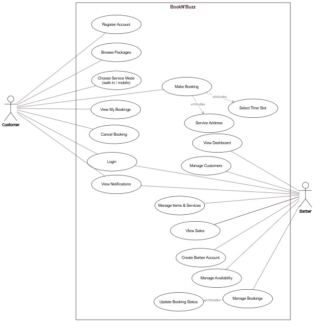

# BookN'Buzz — Barber Shop Booking System

[](https://www.python.org/)
[](https://www.djangoproject.com/)
[](https://www.sqlite.org/)

BookN'Buzz is a barber shop booking web app I built for a university Software
Engineering project. It lets customers browse grooming packages and book a
barber, and it gives barbers a place to manage their schedule, their bookings,
and the shop's services.

It is built with Python and Django, and it stores everything in SQLite (Django's
default database). It follows Django's Model, Template, View (MTV) structure:

- The **Model** lives in `bookings/models/`. These are the Django ORM classes
  that map to the class diagram, with one file per entity, and the database is
  created from migrations.
- The **View** lives in `bookings/views/` and `bookings/urls.py`. These are
  plain function based views, split into a `user/` area and a `barber/` area.
  Pages are protected with `@login_required` and a custom `@barber_required`.
- The **Template** lives in `bookings/templates/`, written in the Django
  template language, with `static/` holding the CSS, images, and a couple of
  small vanilla JavaScript calendars.

There is no Django REST Framework, no MySQL or Postgres, and no front end
framework. It is just Django, its ORM on SQLite, the Django template engine, and
plain HTML and CSS.

## Table of contents

- [Use case diagram](#use-case-diagram)
- [Quick start](#quick-start)
- [Demo login credentials](#demo-login-credentials)
- [How the models map to the class diagram](#how-the-models-map-to-the-class-diagram)
- [Data model](#data-model-sqlite-built-by-migrations)
- [Use cases and where they live](#use-cases-and-where-they-live)
- [How a booking works](#how-a-booking-works)
- [Mobile service fee](#mobile-service-fee)
- [Security and validation](#security-and-validation)
- [Project structure](#project-structure)
- [Resetting the database](#resetting-the-database)

## Use case diagram



The editable source is [`BookN'Buzz.drawio`](BookN'Buzz.drawio) — open it at
[app.diagrams.net](https://app.diagrams.net) to view or edit it.

## Quick start

The repo root contains a `BookNBuzz/` folder, and `manage.py` sits one level
further in, at `BookNBuzz/BookNBuzz/` — that's why the snippet below `cd`s
into `BookNBuzz` twice.

```powershell
# clone the repo
git clone https://github.com/amshar27/BookNBuzz.git
cd BookNBuzz                      # repo root

python -m venv .venv
.venv\Scripts\Activate.ps1        # Windows (PowerShell)
# source .venv/bin/activate       # macOS / Linux

cd BookNBuzz                      # the folder that actually holds manage.py

# 1. install dependencies
pip install -r requirements.txt

# 2. create the database from migrations
python manage.py migrate

# 3. load demo data
python manage.py seed_demo

# 4. run the app
python manage.py runserver
```

Then open **http://localhost:8000** in your browser.

## Demo login credentials

| Role           | Email                    | Password      |
|----------------|--------------------------|---------------|
| Barber / admin | `marcus@booknbuzz.com`   | `barber123`   |
| Barber         | `theo@booknbuzz.com`     | `barber123`   |
| Barber         | `aisha@booknbuzz.com`    | `barber123`   |
| Customer       | `alex@example.com`       | `password123` |
| Customer       | `sam@example.com`        | `password123` |
| Customer       | `jordan@example.com`     | `password123` |

`marcus@booknbuzz.com` is also a Django superuser, so it can sign in to the
admin site at **/admin**. You can also register a brand new customer from the
**Sign up** page.

## How the models map to the class diagram

`bookings/models/` holds the ORM models, one file per entity:

```
User (custom auth user, role = 'customer' or 'barber')   has initials, unread_count()
Service                                                  the grooming packages
Availability     a barber's weekly hours and blocked days; has open_slots()
Booking          links a Customer, a Barber and a Service; has compute_total()
Notification     belongs to a User
```

There is a single `User` model with a `role` flag, and the barber doubles as the
shop admin. A `Booking` points to a customer `User`, a barber `User`, and a
`Service` through foreign keys. Everything goes through the Django ORM.

## Data model (SQLite, built by migrations)

| Table           | Key columns                                                                 |
|-----------------|------------------------------------------------------------------------------|
| `users`         | id, name, email, password, role (`customer`/`barber`), phone, is_staff      |
| `services`      | id, name, description, duration_minutes, price, image, active               |
| `availability`  | id, barber_id (FK users), weekday, date, start_time, end_time, is_blocked   |
| `bookings`      | id, customer_id (FK users), barber_id (FK users), service_id (FK services), mode (`walk_in`/`mobile`), date, time_slot, service_address, status, total_price, created_at |
| `notifications` | id, user_id (FK users), message, is_read, created_at                        |

A partial `UniqueConstraint` called `idx_no_double_booking` stops the same
barber from being booked twice for the same date and time slot. Cancelled
bookings are excluded, so they free the slot again.

## Use cases and where they live

Every use case is a named Django view.

**Customer**

| Use case                | URL name                                                            |
|-------------------------|---------------------------------------------------------------------|
| Register account        | `auth_register`                                                     |
| Login and logout        | `auth_login`, `auth_logout`                                         |
| Browse packages         | `customer_packages`, `customer_service_detail`                      |
| Make a booking          | `customer_book`, then `customer_book_times`, then `customer_confirm_booking` |
| Live time slots (JSON)  | `customer_book_slots`                                               |
| View my bookings        | `customer_my_bookings`                                              |
| Cancel a booking        | `customer_cancel_booking`                                           |
| View notifications      | `customer_notifications`                                            |
| My account / profile    | `customer_account`                                                  |

**Barber / admin**

| Use case                  | URL name                                                            |
|---------------------------|---------------------------------------------------------------------|
| View dashboard            | `barber_dashboard`                                                  |
| Manage customers          | `barber_customers`                                                  |
| Manage items and services | `barber_services`, `barber_service_new`/`edit`/`delete`            |
| View sales                | `barber_sales`                                                      |
| Create barber account     | `barber_barber_new`                                                 |
| Manage availability       | `barber_availability`, `barber_set_weekday`, `barber_toggle_block` |
| Manage bookings           | `barber_bookings` (per date, plus a "pending, all dates" view)     |
| Confirm, claim, release   | `barber_confirm_booking`, `barber_claim_booking`, `barber_release_booking` |
| Update booking status     | `barber_update_status` (this also creates a notification)          |
| Profile                   | `barber_profile`                                                    |

## How a booking works

A customer logs in, browses the packages, and picks a service. Next they choose
a barber, and the app shows only that barber's open time slots. A slot only
appears if it falls inside the barber's weekly hours, is not on a blocked day,
is not already booked, and is not in the past. The customer then chooses walk-in
or mobile (mobile needs a service address) and confirms.

The booking is saved as **pending** and assigned to that barber, and a
notification goes out. The barber confirms it, which moves it from pending to
confirmed, and later marks it completed or cancelled. The customer sees each
change in **My Bookings** and **Notifications**.

There is also a legacy path for unclaimed bookings, where the barber shows as
N/A. Any barber can claim one of these from the shared bookings page, and a
barber can release a confirmed booking back to the pool.

## Mobile service fee

Mobile bookings carry a flat **RM25.00** fee, and walk-ins do not. The amount is
defined once as `MOBILE_SERVICE_FEE` in `bookings/models/booking.py`. It shows up
as its own line on the booking summary, and it is added into `total_price` on
the server when the booking is confirmed, so the total sent by the browser is
never trusted. The Sales report, My Bookings, and Manage Bookings all show the
total with the fee included.

## Security and validation

- Passwords are hashed by Django's auth system and never stored in plain text.
- Pages use session auth, with `@login_required` and a custom `@barber_required`
  role check in `bookings/decorators.py`.
- Every POST form includes CSRF protection through ``.
- The ORM parameterises every query.
- Validation happens on the server and uses Django's messages framework.
- Double booking is blocked both in the view logic and by a database unique
  constraint.
- All the booking rules (no past, blocked, out of hours, or double booked slots)
  are checked again in the view when a booking is confirmed.

## Project structure

There are three folders with similar names, and each does a different job:

- **`BookNBuzz/`** is the outer project root. It is where you run commands from,
  and it holds `manage.py` plus the two packages below.
- **`booknbuzz/`** is the Django config package. It holds the site wide settings,
  the root URL map, and the WSGI and ASGI entry points. It has no features, only
  wiring, and `manage.py` points Django at `booknbuzz.settings`.
- **`bookings/`** is the app itself, with all the real code (models, views,
  templates, and so on).

```
BookNBuzz/                    # project root (run manage.py here)
├─ manage.py
├─ requirements.txt
├─ booknbuzz/                 # config package (no features, just wiring)
│  ├─ settings.py             #   global settings (apps, DB, auth, static)
│  ├─ urls.py                 #   root URL map (/admin, / to home, include app)
│  ├─ wsgi.py  asgi.py        #   server entry points
│  └─ __init__.py
└─ bookings/                  # the app, all the real code
   ├─ models/                 # MODEL, one file per entity
   │  ├─ user.py  service.py  booking.py  availability.py  notification.py
   ├─ views/                  # VIEW, grouped by audience
   │  ├─ helpers.py           #   shared helpers and constants
   │  ├─ user/                #   auth and customer use cases
   │  │  ├─ auth_views.py  customer_views.py
   │  └─ barber/              #   barber and admin area
   │     ├─ dashboard_views.py  service_views.py
   │     ├─ availability_views.py  booking_views.py
   ├─ templates/              # TEMPLATE
   │  ├─ base.html
   │  ├─ user/   barber/   auth/   account/
   ├─ static/                 # css, images, js (the two booking calendars)
   ├─ urls.py                 # URL routes
   ├─ decorators.py           # barber_required role gate
   ├─ profile_service.py      # shared "edit my account" logic
   ├─ context_processors.py   # current_user, unread_count, mobile_fee
   ├─ admin.py                # admin registrations
   ├─ templatetags/booknbuzz_extras.py   # money and tojson filters
   ├─ management/commands/seed_demo.py    # demo data loader
   └─ migrations/
```

## Resetting the database

Running `python manage.py seed_demo` again clears the demo rows and rebuilds
them. If you want to start completely fresh, delete `booknbuzz.db`, run
`python manage.py migrate` to rebuild the schema, and then run
`python manage.py seed_demo` once more.


